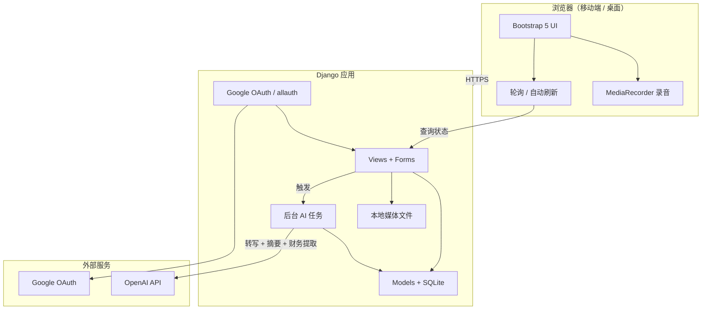
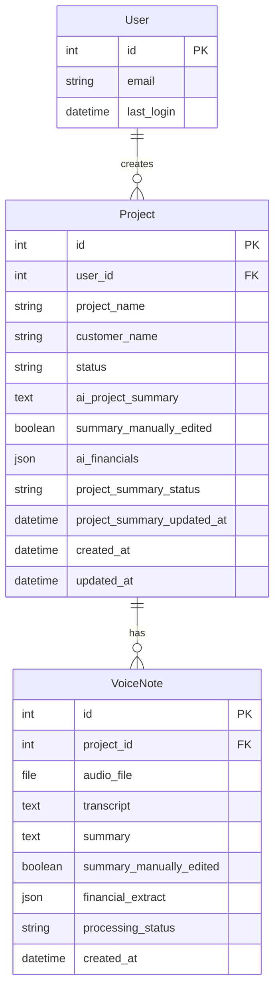

# Claaxy Log — 开发文档（V1）

> 文档版本：1.5  
> 项目类型：AI 辅助语音记录 / Job Costing 工具  
> 状态：规划阶段

---

## 1. 项目概述

### 1.1 项目名称

**Claaxy Log**

### 1.2 目标用户

承包商（Contractors）、小型企业主——需要在现场快速记录工时、材料、费用，并借助 AI 整理成可查阅的项目摘要。

### 1.3 核心目标

提供一个**简单、快速、移动端友好**的 Web 应用，让用户能够：

1. 用 Google 账号登录
2. 创建并管理项目
3. 录制语音并上传
4. 自动获得转写文本 + AI 摘要
5. 在同一项目下集中查看所有 Voice Note
6. **查看项目级 AI 摘要（Project Summary）**——老板一眼看懂项目进展，无需逐条阅读 Voice Note
7. **口述收入与各项花费，AI 自动提取并展示**——支持中英文混合语音
8. **手动编辑或删除 AI 生成的 Summary**——识别不准时可改，录错可删整条 Voice Note

### 1.4 V1 成功标准

用户能够：**Google 登录 → 创建项目 → 口述「卖了8000，人工5000，材料2000…」→ 上传后立即返回 → AI 转写并提取收入/花费明细 → 在项目页看到收入、各项花费、利润与 Project Summary**。

### 1.5 V1 明确不做

- 邮箱注册 / 密码登录
- 密码重置 / 修改密码
- 邀请制 / 团队协作
- 复杂仪表盘、报表、导出
- 收据 / Receipt 上传
- Settings / 公司设置 / 用户资料页
- 手工录入 / 编辑 / 删除**财务金额**（财务仍仅来自语音 AI 提取）
- 复杂财务：分类账、发票、税务、多币种、审批流
- 高级权限与角色
- 实时协作、推送通知

---

## 2. 技术栈

| 层级 | 技术 | 说明 |
|------|------|------|
| 后端框架 | Django 5.x | 单体应用，快速交付 |
| 数据库 | SQLite | V1 单机部署，零运维 |
| 模板 | Django Templates + HTML | 服务端渲染，简单可靠 |
| UI | Bootstrap 5 | 响应式、移动端优先 |
| 认证 | Google OAuth 2.0 | 唯一登录方式，无本地密码 |
| AI | OpenAI API | Whisper（转写，支持中英文混合）+ Chat Completions（摘要 + 财务提取） |
| 后台任务 | Python threading（V1） | 上传后立即返回，AI 异步处理；后期可升级 Celery |
| 文件存储 | 本地 `MEDIA_ROOT` | V1 不做 S3/云存储 |
| 语音采集 | Web MediaRecorder API | 浏览器端录音，上传 blob |

### 2.1 推荐 Python 依赖

```
django>=5.0
django-allauth          # Google OAuth 集成
python-dotenv           # 环境变量
openai>=1.0             # OpenAI SDK
whitenoise              # 静态文件生产部署（可选）
```

---

## 3. 系统架构

### 3.1 高层架构



### 3.2 语音记录流程（异步，V1 标准）

```
用户点击「开始录音」
  → 浏览器 MediaRecorder 采集音频
  → 点击「停止并上传」→ POST multipart 到 Django
  → 保存 VoiceNote.audio_file，processing_status = pending
  → 立即返回项目页（不等待 AI）
  → 后台线程启动：
       1. processing_status = processing
       2. OpenAI Transcription → 保存 transcript（支持中英文混合口述）
       3. OpenAI Chat → 保存 VoiceNote.summary + VoiceNote.financial_extract（JSON）
       4. VoiceNote.processing_status = completed
       5. 触发 Project 级更新（见 3.3 / 6.4）：
            - 汇总所有语音中的收入与花费
            - 写入 Project.ai_financials
            - 生成 Project.ai_project_summary
  → 项目页轮询 / 自动刷新，显示 Processing → Completed
```

**设计原则：** 用户上传后**绝不**在 HTTP 请求中同步等待 Whisper + GPT。3 分钟录音可能导致 30+ 秒转圈，体验差。

### 3.3 Project 级更新流程（Summary + 财务）

```
某条 VoiceNote 处理完成（或用户点击 Regenerate Summary）
  → project_summary_status = processing
  → 输入：该项目所有 completed VoiceNote 的 transcript（按时间排序）
  → OpenAI Chat 一次性输出：
       1. 项目进展摘要 → Project.ai_project_summary
       2. 结构化财务 → Project.ai_financials（JSON）
            - income：项目总收入（数字）
            - expenses：[{ "label": "人工", "amount": 5000 }, ...]
            - profit：income − sum(expenses)，由 AI 或后端校验计算
  → project_summary_status = completed
  → 页面自动刷新，展示收入、花费明细、利润与 Summary
```

**口述示例：**

> 「这单卖了8000，花费有人工5000，材料2000，吃饭100，加油50」

**页面展示：**

```
Income（收入）     8,000
Expenses（花费）
  · 人工           5,000
  · 材料           2,000
  · 吃饭             100
  · 加油              50
Profit（利润）       850
```

**多条语音合并规则：** 后续语音若补充新花费或修正收入，Regenerate 或新 Voice Note 完成后，AI **重新阅读全部 transcript** 生成最新汇总（以全量语音为准，不做简单累加，避免重复计数）。

---

## 4. 数据模型设计

### 4.1 ER 关系



### 4.2 模型字段明细

#### User（Django User + Google OAuth）

| 字段 | 类型 | 说明 |
|------|------|------|
| `id` | PK | Django 内置 |
| `email` | EmailField | 来自 Google，唯一 |
| `last_login` | DateTimeField | Django 内置 |

> **实现建议：** 使用 `django-allauth` 的 `SocialAccount` 完成 Google 登录。**V1 无 Settings 页**，不扩展 UserProfile / Company 模型。

#### Project

| 字段 | 类型 | 约束 |
|------|------|------|
| `user` | FK → User | 数据隔离：仅本人可见 |
| `project_name` | CharField(200) | 必填 |
| `customer_name` | CharField(200) | 必填 |
| `status` | CharField | choices: `active`, `completed` |
| `ai_project_summary` | TextField | 项目级 AI 进展摘要，可空；**可手动编辑或清空** |
| `summary_manually_edited` | BooleanField | 默认 False；用户手动改过摘要后为 True |
| `ai_financials` | JSONField | AI 提取的项目财务，见下方结构，可空 |
| `project_summary_status` | CharField | `idle` / `processing` / `completed` / `failed` |
| `project_summary_error` | TextField | 失败时记录，可选 |
| `project_summary_updated_at` | DateTimeField | 可空，最后一次生成时间 |
| `created_at` | DateTimeField | auto_now_add |
| `updated_at` | DateTimeField | auto_now |

**`ai_financials` JSON 结构（AI 写入，页面只读展示）：**

```json
{
  "income": 8000,
  "expenses": [
    { "label": "人工", "amount": 5000 },
    { "label": "材料", "amount": 2000 },
    { "label": "吃饭", "amount": 100 },
    { "label": "加油", "amount": 50 }
  ],
  "profit": 850
}
```

- `label`：保留用户口述原文（中英文均可，如 labour / 人工）
- `profit`：优先由后端计算 `income − sum(expenses)`，与 AI 输出交叉校验
- 无语音或语音未提及金额时，对应字段为 `null` 或空数组

**计算字段（不存库，视图层）：**

| 字段 | 来源 |
|------|------|
| `voice_note_count` | `project.voice_notes.count()` |
| `latest_activity` | 最新一条 `completed` VoiceNote 的 `summary` 首行（截断展示） |

#### VoiceNote

| 字段 | 类型 | 约束 |
|------|------|------|
| `project` | FK → Project | CASCADE |
| `audio_file` | FileField | `upload_to='voice_notes/%Y/%m/'` |
| `transcript` | TextField | 可空，Whisper 填充；**支持中英文混合** |
| `summary` | TextField | 可空，AI 填充；**可手动编辑** |
| `summary_manually_edited` | BooleanField | 默认 False；手动编辑后为 True |
| `financial_extract` | JSONField | 可空，**本条语音** AI 提取的收入/花费 |
| `processing_status` | CharField | `pending` / `processing` / `completed` / `failed` |
| `error_message` | TextField | 失败时记录，可选 |
| `created_at` | DateTimeField | auto_now_add |

> **设计原则：** 用户**只通过语音**录入财务信息，不提供任何手工记账表单。单条 VoiceNote 存 `financial_extract` 便于列表预览；项目级以 `Project.ai_financials` 为准。

### 4.3 索引建议

- `Project(user_id, status)`
- `VoiceNote(project_id, -created_at)`
- `VoiceNote(project_id, processing_status)`

---

## 5. 认证设计

### 5.1 策略

- **仅 Google Sign-In**
- 无注册表单：首次 Google 登录自动创建 User
- **无 Settings 页、无 Company / UserProfile**
- **无密码、无修改密码、无重置、无邀请**

### 5.2 实现方案

使用 **django-allauth**：

- `AUTHENTICATION_BACKENDS`：`ModelBackend` + `allauth.account.auth_backends.AuthenticationBackend`
- `SOCIALACCOUNT_PROVIDERS`：配置 Google `client_id` / `secret`
- `ACCOUNT_EMAIL_REQUIRED = True`
- `ACCOUNT_USERNAME_REQUIRED = False`
- `SOCIALACCOUNT_AUTO_SIGNUP = True`
- 禁用本地 signup URL（或重定向到 Google 登录）

### 5.3 路由

| URL | 说明 |
|-----|------|
| `/accounts/google/login/` | Google 登录 |
| `/accounts/logout/` | 登出 |
| `/` | 未登录 → 登录页；已登录 → Dashboard |

### 5.4 Google Cloud Console 配置清单

1. 创建 OAuth 2.0 Client（Web application）
2. 授权重定向 URI：`https://yourdomain.com/accounts/google/login/callback/`
3. 本地开发：`http://127.0.0.1:8000/accounts/google/login/callback/`

---

## 6. 功能模块规格

### 6.1 Dashboard（`/dashboard/`）

**功能：**

- 列出当前用户所有 Project（按 `updated_at` 降序）
- 「Create New Project」按钮 → 表单页
- 每个项目卡片显示：项目名、客户名、状态徽章、Voice Note 数量、**利润**（或收入/花费简要）、最近更新时间

**权限：** `@login_required`，QuerySet 过滤 `user=request.user`

### 6.2 项目管理

#### 创建项目（`/projects/new/`）

- 字段：`project_name`, `customer_name`, `status`（默认 Active）
- 成功后跳转 → 项目详情页

#### 项目详情（`/projects/<id>/`）

页面自上而下分三块：

**① Project Summary + 财务（置顶，最重要）**

```
Smith Backyard · 12 Voice Notes

── Finances（来自语音，AI 提取）──
Income（收入）              8,000
Expenses（花费）
  · 人工                    5,000
  · 材料                    2,000
  · 吃饭                      100
  · 加油                       50
Profit（利润）                850

Latest Activity:
这单卖了8000，人工材料等都记好了

AI Project Summary:
- 本单收入 8000
- 主要花费为人工与材料
- 净利润约 850
- 现场工作正常推进

[ Regenerate Summary ]  [ Edit ]  [ Clear ]
Status: Completed / Processing...
```

- **收入 + 各项花费明细 + 利润** 均来自语音 AI 提取，**只读**（修正数字请再录语音或 Regenerate）
- **AI Project Summary** 可 **[ Edit ]** 手动修改、**[ Clear ]** 清空；保存后 `summary_manually_edited = True`
- 点击 **Regenerate Summary** 若已有手动修改，先弹出确认：「将覆盖您编辑过的摘要与财务」
- 支持**中英文混合**口述
- `Latest Activity` 取自最新 completed VoiceNote 的 summary
- `AI Project Summary` 来自 `Project.ai_project_summary`
- 财务数字来自 `Project.ai_financials`
- 有 VoiceNote 或 `project_summary_status = processing` 时，页面**自动刷新**（每 5 秒轮询）

**② 语音记录区**

- Start / Stop Recording、上传进度
- 上传成功后立即回到本页，新 Voice Note 显示 `Processing`

**③ Voice Notes 列表**

- 每条显示：序号、时间、状态徽章、摘要预览
- 若本条含金额，展示提取结果预览（如「收入 8000 · 花费 4 项」）
- 展开查看完整 transcript
- 每条 completed 记录操作：**[ Edit ]** 修改 summary、**[ Delete ]** 删除整条 Voice Note（含音频与 transcript）、**[ Regenerate ]** 重新 AI 生成
- 删除 Voice Note 后，自动基于**剩余** transcript 重新汇总项目财务与 Project Summary

**权限：** 404 若 `project.user != request.user`

#### 编辑 / 完成项目（V1 可选）

- 至少支持修改 `status` 为 Completed
- 可在详情页用简单表单或下拉切换

### 6.3 语音记录

#### 前端（浏览器）

```
navigator.mediaDevices.getUserMedia({ audio: true })
MediaRecorder → chunks → Blob(type: 'audio/webm')
FormData.append('audio', blob, 'recording.webm')
fetch POST → /projects/<id>/voice-notes/upload/
→ 收到 302/JSON 成功 → 立即跳转或刷新项目页（不等待 AI）
```

**UI 要求：**

- 大按钮：「开始录音」「停止并上传」
- 录音中显示计时器 + 视觉反馈（红色圆点）
- 移动端全宽按钮，易于单手操作
- 上传完成后 toast：「已上传，正在识别…」
- 页面提示示例：「你可以说：这单卖了8000，人工5000，材料2000…」

**兼容性注意：**

- iOS Safari 对 MediaRecorder 支持有限；V1 优先 Chrome/Android；iOS 需测试，必要时 V1.1 增加「选择音频文件上传」兜底

#### 后端

- 接收 `multipart/form-data`，字段名如 `audio`
- 校验：文件大小上限（建议 25MB）、MIME 类型
- 创建 `VoiceNote(processing_status='pending')`
- **启动后台线程**处理 AI（见 6.4）
- **立即返回** HTTP 响应（redirect 到项目详情页）

### 6.4 AI 处理（异步）

#### 后台任务实现（V1）

```python
# 概念：上传 view 保存文件后
threading.Thread(target=process_voice_note, args=(voice_note.id,)).start()
return redirect('project_detail', pk=project.id)
```

生产环境用户量上升后，可替换为 Celery + Redis，接口与状态字段不变。

#### Step 1：Voice Note 转写（Whisper）

- 模型：`whisper-1`
- 输入：本地音频文件
- 输出：写入 `VoiceNote.transcript`
- **语言：** 不强制单一语言；Whisper 自动处理**中英文混合**口述
- 状态：`processing_status = processing`

#### Step 2：单条语音 — 摘要 + 财务提取

- 模型：`gpt-4o-mini`，**单次调用返回 JSON**（`response_format: json_object`）
- 输入：`VoiceNote.transcript`
- 输出：
  - `summary` → `VoiceNote.summary`（工作/进展类叙述，可中英混合）
  - `financial_extract` → `VoiceNote.financial_extract`

Prompt 方向：

```
你是承包商 job costing 助手。根据以下语音转写（可能是中文、英文或中英混合），完成两项任务：

1. summary：简洁摘要（进展、工时、待办等）
2. financial_extract：从口述中提取金额，JSON 格式：
   {
     "income": <number|null>,
     "expenses": [{"label": "<口述原文>", "amount": <number>}, ...],
     "profit": <income - sum(expenses)|null>
   }

规则：
- 收入：如「卖了8000」「this job is 8000」→ income: 8000
- 花费：逐项提取，label 保留用户原话（人工/labour/材料/materials/吃饭/加油等）
- 未提及金额则 income 为 null、expenses 为空数组
- 数字只输出阿拉伯数字，不要货币符号
- 中英文金额都要识别（eight thousand = 8000）
```

- 完成后：`VoiceNote.processing_status = completed`

#### Step 3：Project 级 — 进展摘要 + 财务汇总

- **触发时机：** 某条 VoiceNote 处理完成；或 Regenerate Summary
- 输入：该项目所有 `completed` VoiceNote 的 **transcript**（按时间排序，全量）
- 输出：
  - `ai_project_summary` → 老板可读的进展摘要
  - `ai_financials` → 合并后的项目财务 JSON（结构见 4.2）
- 状态：`project_summary_status = processing` → `completed`

Project 级 Prompt 方向：

```
你是承包商项目经理助手。根据以下多条现场语音转写（中英混合），生成：

1. ai_project_summary：项目进展要点（老板快速阅读）
2. ai_financials：合并所有语音中的财务信息，JSON：
   {
     "income": <项目总收入|null>,
     "expenses": [{"label":"...", "amount":...}, ...],
     "profit": <number|null>
   }

规则：
- 阅读全部 transcript，去重合并相同花费项（若用户重复口述以最新为准）
- expenses 逐项列出用户说过的每一类花费及金额
- 若只有花费无收入，income 可为 null
- 数字仅用阿拉伯数字
```

#### 重新生成 vs 手动编辑 Summary

| 操作 | 范围 | 行为 |
|------|------|------|
| **Edit** | Voice Note / Project | 表单或 inline 编辑 `summary` / `ai_project_summary`；设 `summary_manually_edited = True` |
| **Clear** | Project | 清空 `ai_project_summary`（财务区块不受影响，除非另点 Regenerate） |
| **Delete** | Voice Note | 删除整条记录（音频文件一并删除）；触发项目级财务 + Summary 重算 |
| **Regenerate** | Voice Note / Project | 重新 AI 生成；**覆盖**手动编辑过的 Summary（需确认提示） |

**价值：** AI 识别不准时可人工改摘要；录错整条可 Delete；Prompt 升级时用 Regenerate 刷新。

#### 错误处理

- API 失败 → 对应 `failed` + `error_message`
- Voice Note 失败：显示「处理失败」，提供「重试处理」按钮（重新跑 Whisper + GPT）
- Project Summary 失败：Summary 区块显示错误，保留旧摘要（若有）

#### 环境变量

```
OPENAI_API_KEY=sk-...
OPENAI_TRANSCRIPTION_MODEL=whisper-1
OPENAI_SUMMARY_MODEL=gpt-4o-mini
```

### 6.5 状态轮询 API

项目页存在 `pending` / `processing` 状态时，前端每 5 秒请求：

**GET** `/projects/<pk>/status/`

```json
{
  "project_summary_status": "processing",
  "voice_notes": [
    { "id": 12, "processing_status": "processing" },
    { "id": 11, "processing_status": "completed", "summary": "Installed interlock..." }
  ],
  "ai_project_summary": "...",
  "ai_financials": {
    "income": 8000,
    "expenses": [
      { "label": "人工", "amount": 5000 },
      { "label": "材料", "amount": 2000 },
      { "label": "吃饭", "amount": 100 },
      { "label": "加油", "amount": 50 }
    ],
    "profit": 850
  },
  "latest_activity": "这单卖了8000...",
  "voice_note_count": 12
}
```

全部完成后停止轮询，刷新 DOM 或整页 reload。

---

## 7. URL 与视图规划

| URL | View | Method | 说明 |
|-----|------|--------|------|
| `/` | `home` | GET | 重定向 |
| `/dashboard/` | `dashboard` | GET | 项目列表 |
| `/projects/new/` | `project_create` | GET/POST | 新建项目 |
| `/projects/<pk>/` | `project_detail` | GET | 项目详情 + Summary + 列表 |
| `/projects/<pk>/status/` | `project_status_api` | GET | JSON 轮询状态 |
| `/projects/<pk>/edit/` | `project_edit` | GET/POST | 编辑（可选） |
| `/projects/<pk>/voice-notes/upload/` | `voice_note_upload` | POST | 上传音频，立即返回 |
| `/projects/<pk>/voice-notes/<id>/regenerate/` | `voice_note_regenerate` | POST | 重新 AI 生成单条 summary + 财务 |
| `/projects/<pk>/voice-notes/<id>/edit-summary/` | `voice_note_edit_summary` | POST | 手动编辑单条 summary |
| `/projects/<pk>/voice-notes/<id>/delete/` | `voice_note_delete` | POST | 删除整条 Voice Note |
| `/projects/<pk>/voice-notes/<id>/retry/` | `voice_note_retry` | POST | 失败重试（Whisper + GPT） |
| `/projects/<pk>/regenerate-summary/` | `project_regenerate_summary` | POST | 重新生成项目摘要 + 财务 |
| `/projects/<pk>/edit-summary/` | `project_edit_summary` | POST | 手动编辑 Project Summary |
| `/projects/<pk>/clear-summary/` | `project_clear_summary` | POST | 清空 Project Summary |
| `/accounts/*` | allauth | — | OAuth |

---

## 8. UI / UX 规范

### 8.1 设计原则

- **速度优先**：上传即走，不阻塞用户
- **移动优先**：Bootstrap 5 栅格 + 大触控目标（min 44px）
- **语音记账**：只说不管填表，AI 提取收入与花费明细
- **老板友好**：财务 + Project Summary 置顶，Voice Notes 细节在下
- **无复杂仪表盘**：列表 + 详情即可

### 8.2 页面结构

```
[Navbar: Logo | Dashboard | Logout]
[Container]
  [Page Title]
  [Primary Action Button]
  [Content Cards / Lists]
[Footer: 可选，极简]
```

### 8.3 Bootstrap 组件使用

- Navbar（collapse 移动端菜单）
- Cards（Project Summary、Voice Notes）
- Badges（Active / Completed / Processing / Failed）
- Alerts（成功/错误消息）
- Spinner（Processing 状态）
- Forms（`form-control`, `form-label`）
- Buttons：`btn-primary` 录音/主操作，`btn-danger` 停止录音 / 删除，`btn-outline-secondary` Edit / Regenerate

### 8.4 关键页面线框

**Dashboard**

```
[+ New Project]

┌─────────────────────────────┐
│ Kitchen Renovation    Active │
│ Customer: John Smith         │
│ Profit $850 · 8 notes        │
│ Updated 2h ago               │
└─────────────────────────────┘
```

**Project Detail**

```
Project: Smith Backyard | Customer: John Smith | [Active ▼]

┌── Summary + Finances ───────────────────────┐
│ 12 Voice Notes                              │
│                                             │
│ Income（收入）                    8,000     │
│ Expenses（花费）                            │
│   · 人工                          5,000     │
│   · 材料                          2,000     │
│   · 吃饭                            100     │
│   · 加油                             50     │
│ Profit（利润）                      850     │
│                                             │
│ AI Project Summary:                         │
│ • 本单收入 8000，主要花费人工与材料         │
│ • 净利润约 850                              │
│                                             │
│ [ Regenerate Summary ]  [ Edit ]  [ Clear ] │
└─────────────────────────────────────────────┘

── Voice Log ──
[ ● Start Recording ]  [ Stop & Upload ]

Voice Notes:
• #12  May 31 14:30  [Processing ⟳]
• #11  May 31 10:00  收入8000·花费4项  [Edit] [Delete] [Regenerate]
• #10  May 30        "Ordered tiles..."     [Edit] [Delete] [Regenerate]
```

---

## 9. 文件存储与安全

### 9.1 媒体文件

```python
MEDIA_URL = '/media/'
MEDIA_ROOT = BASE_DIR / 'media'
```

目录结构：

```
media/
  voice_notes/2025/05/<uuid>.webm
```

**建议：** 音频文件名使用 UUID，避免冲突与路径遍历。

### 9.2 安全要点

| 项 | 措施 |
|----|------|
| 认证 | 所有业务视图 `@login_required` |
| 对象级权限 | 每个 QuerySet / get_object_or_404 校验 `user` |
| CSRF | Django 默认 CSRF token |
| 文件上传 | 扩展名 + MIME + 大小限制 |
| API Key | 仅服务端 `.env`，禁止前端暴露 |
| HTTPS | 生产环境必须 |
| DEBUG | 生产 `DEBUG=False` |
| 无密码面 | 不暴露 password change 路由或表单 |

### 9.3 隐私

- 音频与转写含业务敏感信息；V1 本地存储，需告知用户备份策略
- OpenAI 数据使用政策需在设置或 About 中简要说明

---

## 10. 项目目录结构

```
claaxy_log/
├── manage.py
├── requirements.txt
├── .env.example
├── README.md
├── DEVELOPMENT.md
├── claaxy_log/              # 项目配置
│   ├── settings.py
│   ├── urls.py
│   └── wsgi.py
├── apps/
│   ├── projects/
│   │   ├── models.py        # Project, VoiceNote
│   │   ├── views.py
│   │   ├── forms.py
│   │   └── services/
│   │       ├── openai_service.py
│   │       └── tasks.py
│   └── core/                # 首页、dashboard、OAuth 回调后重定向
├── templates/
│   ├── base.html
│   ├── dashboard.html
│   └── projects/
├── static/
│   ├── css/
│   └── js/
│       ├── recorder.js
│       └── project_poll.js  # 状态轮询 / 自动刷新
└── media/                   # gitignore
```

---

## 11. 环境配置

### 11.1 `.env.example`

```env
SECRET_KEY=your-django-secret-key
DEBUG=True
ALLOWED_HOSTS=127.0.0.1,localhost

# Google OAuth
GOOGLE_CLIENT_ID=
GOOGLE_CLIENT_SECRET=

# OpenAI
OPENAI_API_KEY=

# Optional
OPENAI_TRANSCRIPTION_MODEL=whisper-1
OPENAI_SUMMARY_MODEL=gpt-4o-mini
```

### 11.2 本地开发步骤

1. `python -m venv venv`
2. `pip install -r requirements.txt`
3. 复制 `.env.example` → `.env` 并填写密钥
4. `python manage.py migrate`
5. `python manage.py runserver`
6. 浏览器访问并测试 Google 登录

---

## 12. 开发阶段与里程碑

### Phase 1：项目骨架（约 1–2 天）

- [ ] Django 项目初始化
- [ ] Bootstrap 5 基础模板
- [ ] 环境变量与 settings 拆分

### Phase 2：认证（约 0.5–1 天）

- [ ] django-allauth + Google OAuth
- [ ] 登录 / 登出 / 首页重定向
- [ ] Navbar：Dashboard + Logout（无 Settings）

### Phase 3：项目 CRUD + Summary / 财务 UI（约 1–2 天）

- [ ] Project、VoiceNote 模型（含 `ai_financials`、`financial_extract` JSON 字段）
- [ ] Dashboard + 创建 / 详情页
- [ ] 置顶区块：AI 财务（收入 / 花费明细 / 利润）+ Project Summary
- [ ] 权限隔离

### Phase 4：语音 + 异步 AI + 财务提取（约 2–3 天）

- [ ] 前端 MediaRecorder + 上传后立即返回
- [ ] Whisper 转写（中英混合）
- [ ] GPT：单条 summary + financial_extract（JSON）
- [ ] GPT：项目级 ai_project_summary + ai_financials 汇总
- [ ] 状态轮询 API + `project_poll.js` 自动刷新
- [ ] Voice Notes 列表 + 单条财务预览

### Phase 5：Summary 编辑 / 删除 + Regenerate（约 1 天）

- [ ] Voice Note：Edit summary、Delete 整条、Regenerate
- [ ] Project：Edit / Clear Summary、Regenerate（含覆盖确认）
- [ ] 删除 Voice Note 后重算项目财务与 Summary
- [ ] 失败重试

### Phase 6：测试与打磨（约 1–2 天）

- [ ] 移动端测试
- [ ] 异步流程与轮询 UX 验证
- [ ] 基本安全审查
- [ ] README 部署说明

**V1 预估总工期：7–11 个工作日**（单人开发）

---

## 13. 测试计划

### 13.1 手动测试清单

| # | 场景 | 预期 |
|---|------|------|
| 1 | Google 登录 | 成功进入 Dashboard |
| 2 | 创建项目 | 出现在列表，详情页有 Summary + 财务区块 |
| 3 | 中英文混合语音 | Whisper 正确转写，如「卖了8000，labour 5000，材料2000」 |
| 4 | AI 财务提取 | 展示 income、逐项 expenses、profit = income − 花费合计 |
| 5 | 录音上传 | 立即返回项目页，Voice Note 显示 Processing |
| 6 | 异步 AI | 30 秒内 Completed，轮询自动更新财务与 Summary |
| 7 | 追加语音 | 新 Voice Note 完成后，项目财务按全量 transcript 重新汇总 |
| 8 | 编辑 Summary | 手动修改 Voice Note / Project 摘要并保存 |
| 9 | 删除 Voice Note | 记录与音频删除，项目财务与 Summary 重算 |
| 10 | Regenerate Summary | 重新 AI 生成；覆盖手动编辑前需确认 |
| 11 | 用户 A 访问用户 B 的项目 URL | 404 或 403 |
| 12 | 移动端 Chrome | 录音、编辑、删除、轮询正常 |

### 13.2 可选自动化（V1 非必须）

- Django `TestCase`：模型、权限、上传校验
- Mock OpenAI API + 后台任务，验证状态流转

---

## 14. 部署建议（V1 后）

| 项 | 建议 |
|----|------|
| 主机 | Railway / Render / 小型 VPS |
| 数据库 | V1 可继续 SQLite；用户量上升再迁 PostgreSQL |
| 后台任务 | 单机 threading 可用；多 worker 部署时改 Celery + Redis |
| 静态文件 | WhiteNoise 或 Nginx |
| 媒体文件 | 长期建议 S3 / Cloudflare R2 |
| 进程 | Gunicorn + Nginx |
| 密钥 | 平台环境变量，勿提交仓库 |

---

## 15. V1 之后扩展方向

- 手工编辑 AI 提取的**财务金额**（仅 Summary 文本可编辑）
- Settings / 公司资料页
- 工时 × 费率自动计费
- 收据上传 + OCR + 费用提取
- 项目报表 / PDF 导出
- Celery 替换 threading（多实例部署必备）
- 团队多用户 / 公司账户
- iOS 原生录音兜底、PWA 离线缓存
- WebSocket 替代轮询（实时状态推送）

---

## 16. 风险与对策

| 风险 | 影响 | 对策 |
|------|------|------|
| iOS Safari 录音兼容性 | 部分用户无法录音 | V1.1 增加文件上传；文档中说明推荐浏览器 |
| AI 金额识别错误 | 收入/花费不准 | 提示用户口述清晰；支持 Regenerate；可再录语音更正 |
| OpenAI 延迟/失败 | 摘要与财务迟迟不出现 | 异步 + Processing + 自动轮询；失败可重试 |
| 后台线程进程重启丢失 | 任务中断 | V1 可接受；启动时扫描 `pending`/`processing` 重新入队 |
| 音频文件过大 | 上传超时 | 前端限制时长（如 5 分钟）；后端大小限制 |
| SQLite 并发写入 | 多用户时锁 | V1 用户少可接受；监控后升级 PostgreSQL |
| Google OAuth 配置错误 | 无法登录 | 详细 README + 配置检查脚本 |

---

## 17. 交付物清单（V1）

1. 可运行的 Django 应用
2. `requirements.txt`
3. `.env.example`
4. `README.md`（安装、OAuth 配置、运行）
5. 满足成功标准的完整用户流程（含语音财务 + Summary 编辑/删除 + 异步 AI + Regenerate）

---

## 18. 待确认事项

在开始编码前，建议确认以下几点：

1. **界面语言**：UI 标签用英文（Income/Expenses/Profit）、中文、还是双语？
2. **口述语言**：已支持中英混合；是否还需要粤语等方言（Whisper 能力需实测）？
3. **录音时长上限**：建议 V1 设为 5 分钟，是否接受？
4. **项目编辑**：V1 是否需要完整编辑项目名/客户名，还是仅切换状态？
5. **删除 Voice Note**：是否需要二次确认弹窗？（建议：需要）
6. **部署目标**：仅本地开发，还是第一期就要上线（影响 OAuth 域名配置）？
